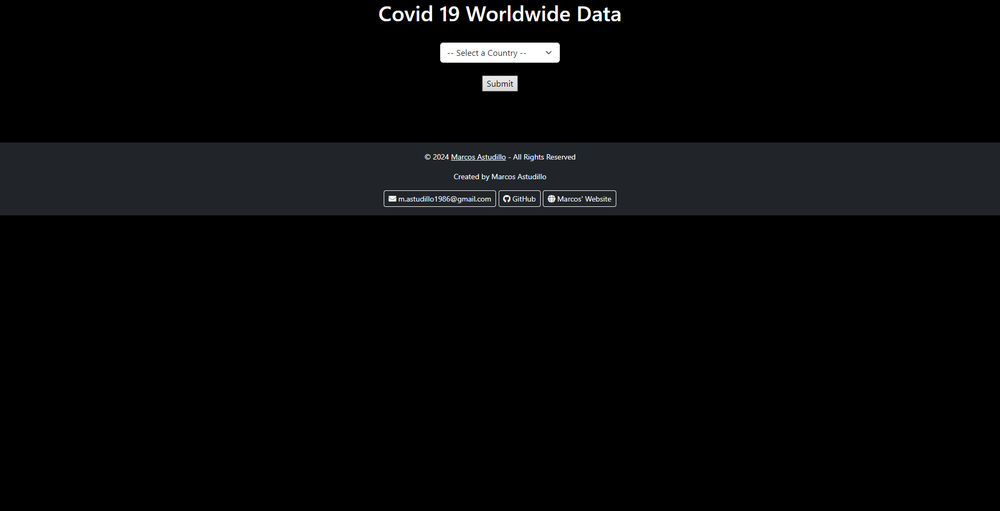
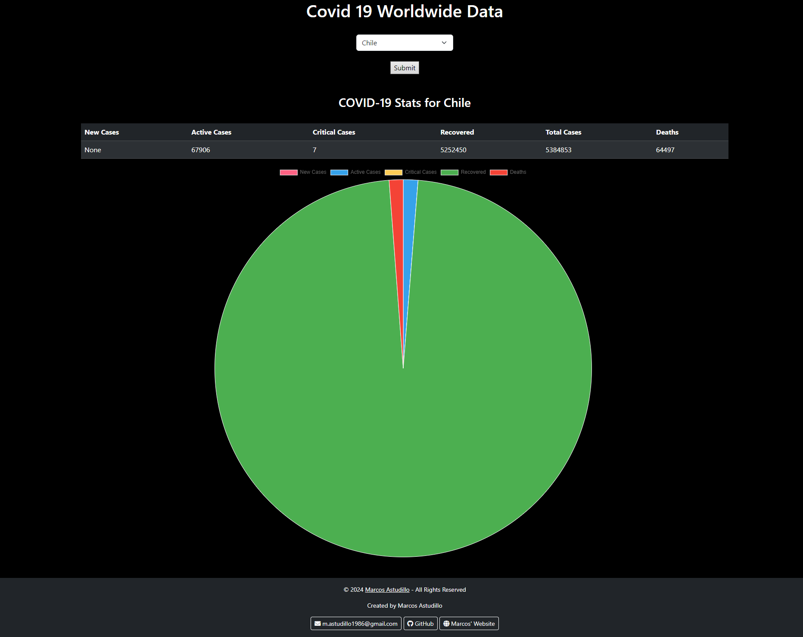

# COVID-19 Worldwide Data

This web application provides global COVID-19 statistics by country. The app retrieves data from a third-party API and displays it in a user-friendly format, including a dynamic pie chart and a table with the most recent COVID-19 data, such as new cases, active cases, critical cases, recoveries, total cases, and deaths.

## Features

- **Worldwide COVID-19 Stats**: Shows the latest data for COVID-19 cases, including active, recovered, and death rates.
- **Country-specific Data**: Allows users to select a country and view COVID-19 statistics specifically for that country.
- **Interactive Pie Chart**: Displays a pie chart visualizing COVID-19 data, such as new cases, active cases, recovered cases, and deaths.
- **User-Friendly Interface**: The interface is responsive and built using Bootstrap for easy navigation and viewing on different devices.

## Screenshots

### Main Page



### COVID-19 Stats for a Selected Country



## Installation

Follow these steps to run the project locally:

1. Clone the repository:

    ```bash
    git clone https://github.com/ThisIsAntonio/covid-worldwide-data.git
    ```

2. Navigate into the project folder:

    ```bash
    cd covid
    ```

3. Install dependencies:

    Make sure you have Python 3 and pip installed. Then, run:

    ```bash
    pip install requests
    ```

4. Start the Django development server:

    ```bash
    python manage.py runserver
    ```

5. Open the application in your browser:

    Go to http://127.0.0.1:8000 to view the application.


# Usage
1. Select a country from the dropdown list.
2. Click the "Submit" button.
3. View the statistics for the selected country, including:
    * New cases
    * Active cases
    * Critical cases
    * Recovered cases
    * Total cases
    * Deaths
4. A pie chart will be displayed to visualize the data.

# Tech Stack

* Frontend: HTML, CSS, Bootstrap, JavaScript
* Backend: Django (Python)
* API: COVID-19 Data API (covid-193.p.rapidapi.com)
* Visualization: Chart.js (for pie charts)


# Contact
Created by Marcos Astudillo
*  Email: m.astudillo1986@gmail.com  
* GitHub: [https://github.com/ThisIsAntonio](https://github.com/ThisIsAntonio)  
* Website: [https://www.marcosastudillo.com](https://www.marcosastudillo.com)

# Acknowledgments
* Thanks to the COVID-19 Data API for providing accurate and real-time information.
* Special thanks to the open-source community for contributing to the development of Django, Bootstrap, and Chart.js.

# Copyright

© 2024 **Marcos Astudillo**. All Rights Reserved.